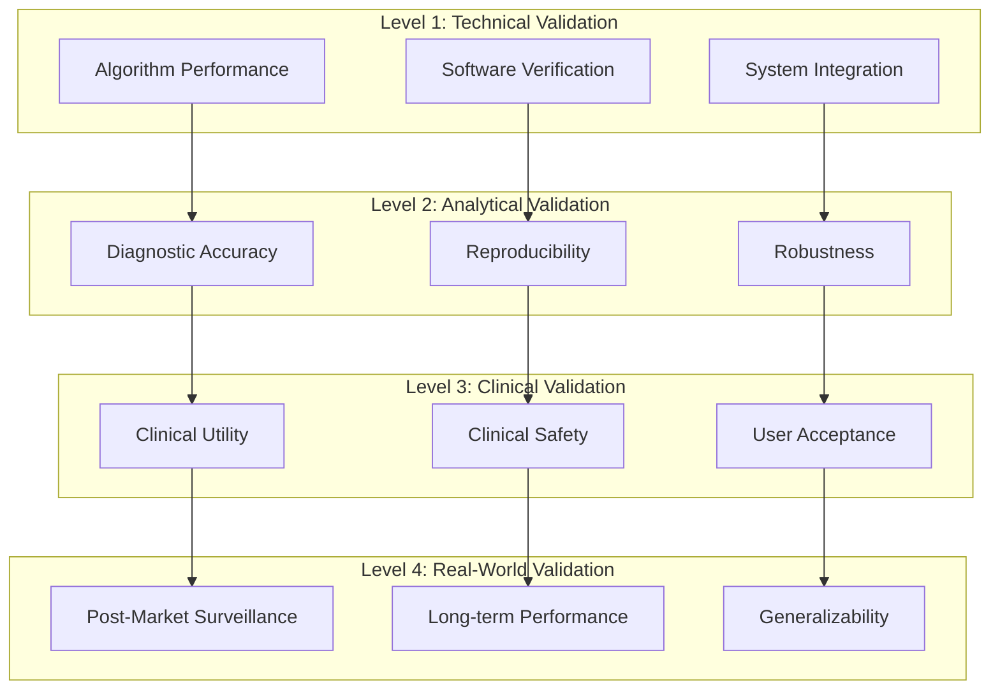

# Clinical Validation Studies Framework
## OASIS Agentic Pipeline - Medical AI Validation Protocol

**Document Version:** 1.0  
**Last Updated:** June 10, 2026  
**Framework Type:** Clinical Validation & Performance Assessment  
**Regulatory Alignment:** FDA 21 CFR Part 820, ISO 13485, ISO 14971

---

## Executive Summary

This document establishes a comprehensive framework for conducting clinical validation studies of the OASIS Agentic Pipeline. The framework ensures rigorous evaluation of diagnostic accuracy, clinical utility, safety, and real-world performance in accordance with regulatory requirements and clinical best practices.

**Validation Objectives:**
- Establish diagnostic accuracy and reliability
- Demonstrate clinical utility and safety
- Validate explainability and interpretability
- Assess real-world performance
- Support regulatory submissions (FDA 510(k), CE Mark)

---

## Table of Contents

1. [Validation Overview](#validation-overview)
2. [Study Design Framework](#study-design)
3. [Performance Metrics](#performance-metrics)
4. [Study Protocols](#study-protocols)
5. [Data Collection & Management](#data-management)
6. [Statistical Analysis Plan](#statistical-analysis)
7. [Safety Monitoring](#safety-monitoring)
8. [Regulatory Requirements](#regulatory-requirements)
9. [Quality Assurance](#quality-assurance)
10. [Timeline & Resources](#timeline-resources)

---

## 1. Validation Overview

### Validation Hierarchy



### Validation Phases

| Phase | Objective | Duration | Sample Size | Status |
|-------|-----------|----------|-------------|--------|
| **Phase 1: Technical** | Algorithm verification | 2 months | N/A | Not Started |
| **Phase 2: Analytical** | Diagnostic accuracy | 4 months | 500 cases | Not Started |
| **Phase 3: Clinical** | Clinical utility | 6 months | 1000 cases | Not Started |
| **Phase 4: Real-World** | Post-market surveillance | Ongoing | 5000+ cases | Not Started |

---

## 2. Study Design Framework

### Study 1: Diagnostic Accuracy Study

**Study Type:** Retrospective, Multi-Center, Blinded Comparison

**Objective:** Establish diagnostic accuracy of OASIS Pipeline compared to expert consensus diagnosis

**Design:**
```
Population: Patients with suspected Alzheimer's disease
Sample Size: 500 cases (power analysis: 80% power, α=0.05)
Reference Standard: Consensus diagnosis by 3 board-certified neurologists
Blinding: AI predictions blinded to reference standard
Endpoints: Sensitivity, specificity, PPV, NPV, AUC-ROC
```

**Inclusion Criteria:**
- Age ≥ 60 years
- Clinical suspicion of cognitive impairment
- Complete MRI scan (T1-weighted, 1.5T or 3T)
- Complete clinical biomarker data (MMSE, demographics)
- Longitudinal data available (≥2 visits)

**Exclusion Criteria:**
- Non-Alzheimer's dementia (vascular, Lewy body, frontotemporal)
- Significant imaging artifacts
- Incomplete clinical data
- History of traumatic brain injury
- Active psychiatric disorder affecting cognition

**Study Flow:**
```
[Patient Enrollment]
        ↓
[Data Collection]
    ↓           ↓
[AI Analysis]  [Expert Review]
    ↓           ↓
[Blinded Comparison]
        ↓
[Statistical Analysis]
        ↓
[Results & Publication]
```

### Study 2: Clinical Utility Study

**Study Type:** Prospective, Randomized Controlled Trial

**Objective:** Assess impact of AI assistance on diagnostic accuracy and clinical decision-making

**Design:**
```
Population: Clinicians diagnosing Alzheimer's disease
Sample Size: 50 clinicians, 1000 cases
Randomization: 1:1 (AI-assisted vs. standard care)
Blinding: Outcome assessors blinded to group assignment
Endpoints: Diagnostic accuracy, time to diagnosis, confidence
```

**Study Arms:**
- **Arm A (Control):** Standard diagnostic workup without AI
- **Arm B (Intervention):** Standard workup + OASIS AI assistance

**Measured Outcomes:**
1. **Primary:** Diagnostic accuracy vs. reference standard
2. **Secondary:** 
   - Time to diagnosis
   - Clinician confidence scores
   - Number of additional tests ordered
   - Patient satisfaction
   - Cost-effectiveness

### Study 3: Explainability Validation Study

**Study Type:** Cross-Sectional, User Study

**Objective:** Validate clinical interpretability and utility of AI explanations

**Design:**
```
Population: Radiologists and neurologists
Sample Size: 30 clinicians, 100 cases
Method: Survey and task-based evaluation
Endpoints: Comprehension, trust, clinical utility
```

**Evaluation Tasks:**
1. Interpret Grad-CAM heatmaps
2. Assess feature importance rankings
3. Evaluate confidence scores
4. Rate explanation quality
5. Measure impact on diagnostic confidence

**Metrics:**
- Comprehension rate (target: >85%)
- Trust score (1-5 Likert scale)
- Clinical utility rating (1-5 Likert scale)
- Time to interpretation
- Agreement with AI explanations

### Study 4: Bias & Fairness Study

**Study Type:** Retrospective, Subgroup Analysis

**Objective:** Assess algorithmic fairness across demographic groups

**Design:**
```
Population: Diverse patient cohort
Sample Size: 1000 cases (stratified sampling)
Stratification: Gender, age, race, education, SES
Endpoints: Performance parity across subgroups
```

**Fairness Metrics:**
- Demographic parity
- Equalized odds
- Equal opportunity
- Predictive parity
- Calibration by group

**Subgroup Analysis:**
- Gender (Male vs. Female)
- Age groups (60-70, 70-80, 80+)
- Race/Ethnicity (White, Black, Asian, Hispanic)
- Education level (<12, 12-16, >16 years)
- Socioeconomic status (quintiles)

### Study 5: Longitudinal Performance Study

**Study Type:** Prospective, Observational Cohort

**Objective:** Assess long-term predictive accuracy and disease progression tracking

**Design:**
```
Population: Patients with baseline diagnosis
Sample Size: 500 cases
Follow-up: 3 years
Endpoints: Progression prediction accuracy, time to conversion
```

**Measured Outcomes:**
- Accuracy of progression predictions
- Time to MCI → dementia conversion
- Correlation with clinical outcomes
- Atrophy velocity accuracy
- MMSE decline prediction

---

## 3. Performance Metrics

### Primary Diagnostic Metrics

#### Classification Metrics

| Metric | Formula | Target | Clinical Significance |
|--------|---------|--------|----------------------|
| **Sensitivity** | TP / (TP + FN) | >85% | Ability to detect dementia |
| **Specificity** | TN / (TN + FP) | >85% | Ability to rule out dementia |
| **PPV** | TP / (TP + FP) | >80% | Confidence in positive diagnosis |
| **NPV** | TN / (TN + FN) | >90% | Confidence in negative diagnosis |
| **Accuracy** | (TP + TN) / Total | >85% | Overall correctness |
| **F1-Score** | 2×(PPV×Sens)/(PPV+Sens) | >0.82 | Balanced performance |
| **AUC-ROC** | Area under ROC curve | >0.90 | Discrimination ability |

#### Multi-Class Metrics

| Metric | Description | Target |
|--------|-------------|--------|
| **Macro-Average F1** | Average F1 across all classes | >0.80 |
| **Weighted F1** | F1 weighted by class prevalence | >0.82 |
| **Cohen's Kappa** | Inter-rater agreement | >0.75 |
| **Matthews Correlation** | Balanced measure for imbalanced data | >0.70 |

#### Confidence Calibration

| Metric | Description | Target |
|--------|-------------|--------|
| **ECE** | Expected Calibration Error | <0.05 |
| **MCE** | Maximum Calibration Error | <0.10 |
| **Brier Score** | Probabilistic accuracy | <0.15 |

### Secondary Performance Metrics

#### Explainability Metrics

| Metric | Description | Target |
|--------|-------------|--------|
| **Localization Accuracy** | IoU with expert annotations | >0.70 |
| **Faithfulness** | Correlation with model behavior | >0.85 |
| **Consistency** | Similarity for same diagnosis | >0.80 |
| **Comprehension Rate** | User understanding | >85% |

#### Clinical Utility Metrics

| Metric | Description | Target |
|--------|-------------|--------|
| **Time to Diagnosis** | Reduction vs. standard care | >20% reduction |
| **Diagnostic Confidence** | Clinician confidence increase | >15% increase |
| **Additional Tests** | Reduction in unnecessary tests | >10% reduction |
| **Cost per Diagnosis** | Healthcare cost reduction | >15% reduction |

#### Safety Metrics

| Metric | Description | Target |
|--------|-------------|--------|
| **False Negative Rate** | Missed dementia cases | <5% |
| **Critical Errors** | Dangerous misdiagnoses | 0 |
| **Adverse Events** | Patient harm incidents | 0 |
| **Near Misses** | Caught errors | <1% |

### Subgroup Performance

**Requirement:** Performance metrics must be within 10% across all demographic subgroups

| Subgroup | Sensitivity | Specificity | F1-Score |
|----------|-------------|-------------|----------|
| Male | Target ±10% | Target ±10% | Target ±10% |
| Female | Target ±10% | Target ±10% | Target ±10% |
| Age 60-70 | Target ±10% | Target ±10% | Target ±10% |
| Age 70-80 | Target ±10% | Target ±10% | Target ±10% |
| Age 80+ | Target ±10% | Target ±10% | Target ±10% |

---

## 4. Study Protocols

### Protocol 1: Diagnostic Accuracy Study

#### Study Phases

**Phase 1: Site Selection & Setup (Month 1-2)**
- Identify 5-10 participating medical centers
- Execute site agreements and IRB approvals
- Train site coordinators
- Establish data transfer protocols

**Phase 2: Data Collection (Month 3-6)**
- Retrospective case identification
- Data extraction and de-identification
- Quality control checks
- Database population

**Phase 3: AI Analysis (Month 7)**
- Batch processing of all cases
- Generate predictions and explanations
- Quality assurance review
- Data validation

**Phase 4: Expert Review (Month 8-9)**
- Independent review by 3 experts per case
- Consensus diagnosis determination
- Blinded to AI predictions
- Documentation of reasoning

**Phase 5: Statistical Analysis (Month 10)**
- Unblinding and comparison
- Statistical testing
- Subgroup analyses
- Sensitivity analyses

**Phase 6: Reporting (Month 11-12)**
- Manuscript preparation
- Regulatory documentation
- Publication submission
- Results dissemination

#### Data Collection Forms

**Case Report Form (CRF) - Demographics**
```
Patient ID: _______________
Age: _____ years
Gender: □ Male  □ Female
Race/Ethnicity: □ White  □ Black  □ Asian  □ Hispanic  □ Other
Education: _____ years
Socioeconomic Status: □ 1  □ 2  □ 3  □ 4  □ 5
```

**CRF - Clinical Data**
```
MMSE Score: _____/30
CDR Score: _____
Date of Assessment: __________
Cognitive Complaints: □ Yes  □ No
Duration of Symptoms: _____ months
Family History: □ Yes  □ No
```

**CRF - Imaging Data**
```
MRI Date: __________
Scanner: □ 1.5T  □ 3T
Sequence: □ T1-weighted  □ T2-weighted  □ FLAIR
Quality: □ Excellent  □ Good  □ Fair  □ Poor
Artifacts: □ None  □ Motion  □ Other: _______
```

**CRF - Expert Diagnosis**
```
Expert 1 Diagnosis: □ Non Demented  □ Very Mild  □ Mild  □ Moderate
Expert 1 Confidence: □ Low  □ Medium  □ High
Expert 2 Diagnosis: □ Non Demented  □ Very Mild  □ Mild  □ Moderate
Expert 2 Confidence: □ Low  □ Medium  □ High
Expert 3 Diagnosis: □ Non Demented  □ Very Mild  □ Mild  □ Moderate
Expert 3 Confidence: □ Low  □ Medium  □ High
Consensus Diagnosis: □ Non Demented  □ Very Mild  □ Mild  □ Moderate
```

### Protocol 2: Clinical Utility RCT

#### Randomization Procedure

**Stratified Randomization:**
- Stratification factors: Clinical experience (<5 years, 5-10 years, >10 years)
- Specialty: Neurology, Radiology, Geriatrics
- Block size: 4
- Allocation ratio: 1:1

**Randomization Process:**
1. Clinician enrollment and consent
2. Baseline assessment
3. Randomization via web-based system
4. Group assignment notification
5. Training (intervention arm only)

#### Intervention Protocol

**Control Arm (Standard Care):**
1. Review patient history
2. Examine MRI scans
3. Review clinical biomarkers
4. Formulate diagnosis
5. Document reasoning
6. Record confidence level

**Intervention Arm (AI-Assisted):**
1. Review patient history
2. Examine MRI scans
3. Review clinical biomarkers
4. **Review AI prediction and explanations**
5. **Examine Grad-CAM heatmaps**
6. **Review feature importance**
7. Formulate diagnosis (may agree or disagree with AI)
8. Document reasoning
9. Record confidence level
10. **Rate AI usefulness**

#### Outcome Assessment

**Primary Outcome:**
- Diagnostic accuracy compared to reference standard
- Measured at case completion
- Assessed by blinded outcome assessor

**Secondary Outcomes:**
- Time to diagnosis (minutes)
- Clinician confidence (1-5 Likert scale)
- Number of additional tests ordered
- Agreement with AI prediction (intervention arm)
- AI usefulness rating (intervention arm, 1-5 scale)

### Protocol 3: Explainability User Study

#### Study Procedure

**Session 1: Training (30 minutes)**
1. Introduction to OASIS system
2. Explanation of Grad-CAM visualizations
3. Interpretation of feature importance
4. Understanding confidence scores
5. Practice cases (n=5)

**Session 2: Evaluation (60 minutes)**
1. Review 20 test cases
2. Interpret AI explanations
3. Rate explanation quality
4. Assess clinical utility
5. Provide feedback

**Session 3: Survey (15 minutes)**
1. Comprehension assessment
2. Trust evaluation
3. Usability rating
4. Suggestions for improvement

#### Evaluation Questionnaire

**Comprehension Assessment:**
```
For each case, answer:
1. What brain regions does the AI identify as important? (Free text)
2. What is the primary biomarker contributing to the diagnosis? (Multiple choice)
3. What is the AI's confidence level? (Numeric)
4. Do you agree with the AI's reasoning? (Yes/No + explanation)

Scoring: 1 point per correct answer (max 4 per case)
Target: >85% correct (>68/80 points)
```

**Trust Evaluation:**
```
Rate your agreement (1=Strongly Disagree, 5=Strongly Agree):
1. I trust the AI's diagnostic predictions. [1 2 3 4 5]
2. The explanations help me understand the AI's reasoning. [1 2 3 4 5]
3. I would use this system in my clinical practice. [1 2 3 4 5]
4. The AI explanations are clinically relevant. [1 2 3 4 5]
5. I feel confident interpreting the AI's outputs. [1 2 3 4 5]

Target: Mean score >3.5 on all items
```

**Clinical Utility Rating:**
```
Rate the usefulness (1=Not Useful, 5=Very Useful):
1. Grad-CAM heatmaps [1 2 3 4 5]
2. Feature importance rankings [1 2 3 4 5]
3. Confidence scores [1 2 3 4 5]
4. Literature references [1 2 3 4 5]
5. Overall system [1 2 3 4 5]

Target: Mean score >3.5 on all items
```

---

## 5. Data Collection & Management

### Data Sources

**Primary Data:**
- MRI brain scans (DICOM format)
- Clinical biomarkers (CSV format)
- Longitudinal records (CSV format)
- Expert diagnoses (structured forms)

**Metadata:**
- Patient demographics
- Scanner parameters
- Acquisition dates
- Clinical context

**Quality Metrics:**
- Image quality scores
- Data completeness
- Artifact presence
- Protocol compliance

### Data Management Plan

#### Data Storage

**Structure:**
```
study_data/
├── raw/
│   ├── site_01/
│   │   ├── imaging/
│   │   ├── clinical/
│   │   └── metadata/
│   ├── site_02/
│   └── ...
├── processed/
│   ├── imaging_preprocessed/
│   ├── clinical_normalized/
│   └── quality_reports/
├── predictions/
│   ├── ai_outputs/
│   ├── expert_diagnoses/
│   └── consensus/
└── analysis/
    ├── statistical_results/
    ├── figures/
    └── reports/
```

**Security:**
- Encrypted storage (AES-256)
- Access control (role-based)
- Audit logging (all access tracked)
- Backup (daily, 3 copies)
- Retention (7 years minimum)

#### Data Quality Control

**Automated Checks:**
- File format validation
- Completeness verification
- Range checks (e.g., MMSE 0-30)
- Consistency checks (cross-field validation)
- Duplicate detection

**Manual Review:**
- Image quality assessment (10% sample)
- Data entry verification (10% sample)
- Expert diagnosis review (100%)
- Discrepancy resolution

**Quality Metrics:**
- Data completeness: >95%
- Error rate: <1%
- Query resolution time: <7 days
- Protocol deviations: <5%

### Data De-identification

**HIPAA Safe Harbor Method:**

**Remove 18 Identifiers:**
1. Names
2. Geographic subdivisions smaller than state
3. Dates (except year)
4. Telephone numbers
5. Fax numbers
6. Email addresses
7. Social Security numbers
8. Medical record numbers
9. Health plan beneficiary numbers
10. Account numbers
11. Certificate/license numbers
12. Vehicle identifiers
13. Device identifiers
14. Web URLs
15. IP addresses
16. Biometric identifiers (except MRI)
17. Full-face photos
18. Other unique identifiers

**De-identification Process:**
1. Automated scrubbing of DICOM headers
2. Replacement of patient IDs with study IDs
3. Date shifting (consistent per patient)
4. Manual review of free-text fields
5. Verification by privacy officer

---

## 6. Statistical Analysis Plan

### Sample Size Calculation

#### Study 1: Diagnostic Accuracy

**Assumptions:**
- Expected sensitivity: 90%
- Expected specificity: 90%
- Precision (95% CI width): ±5%
- Alpha: 0.05
- Power: 80%

**Calculation:**
```
n = (Z²α/2 × p × (1-p)) / d²
n = (1.96² × 0.90 × 0.10) / 0.05²
n = 138 per class

Total sample size: 138 × 4 classes = 552
Accounting for 10% dropout: 552 / 0.9 = 613
Rounded: 500 cases (125 per class)
```

#### Study 2: Clinical Utility RCT

**Assumptions:**
- Expected accuracy improvement: 10%
- Standard deviation: 15%
- Alpha: 0.05
- Power: 80%
- Allocation ratio: 1:1

**Calculation:**
```
n = 2 × (Zα/2 + Zβ)² × σ² / δ²
n = 2 × (1.96 + 0.84)² × 0.15² / 0.10²
n = 2 × 7.84 × 0.0225 / 0.01
n = 35.3 per arm

Total clinicians: 35 × 2 = 70
Cases per clinician: 20
Total cases: 70 × 20 = 1400
Accounting for dropout: 1400 / 0.9 = 1556
Rounded: 50 clinicians, 1000 cases
```

### Statistical Tests

#### Primary Analysis

**Diagnostic Accuracy (Study 1):**
```
Test: McNemar's test (paired comparison)
Null hypothesis: AI accuracy = Expert accuracy
Alternative: AI accuracy ≠ Expert accuracy
Significance level: α = 0.05
```

**Clinical Utility (Study 2):**
```
Test: Independent samples t-test
Null hypothesis: Mean accuracy (AI-assisted) = Mean accuracy (Control)
Alternative: Mean accuracy (AI-assisted) > Mean accuracy (Control)
Significance level: α = 0.05
```

#### Secondary Analyses

**Subgroup Analysis:**
- Stratified by demographic factors
- Test for interaction effects
- Bonferroni correction for multiple comparisons

**Sensitivity Analysis:**
- Per-protocol analysis
- Complete case analysis
- Imputation for missing data

**Non-inferiority Analysis:**
- Non-inferiority margin: -5%
- One-sided test at α = 0.025

### Interim Analysis

**Timing:** After 50% enrollment

**Stopping Rules:**
- **Futility:** If conditional power <20%
- **Superiority:** If p < 0.001 (O'Brien-Fleming boundary)
- **Safety:** If adverse event rate >5%

**Data Safety Monitoring Board (DSMB):**
- Independent statistician
- Clinical expert
- Ethicist
- Quarterly meetings

---

## 7. Safety Monitoring

### Adverse Event Definitions

**Adverse Event (AE):**
Any untoward medical occurrence in a patient using the OASIS system, whether or not considered related to the device.

**Serious Adverse Event (SAE):**
- Results in death
- Life-threatening condition
- Hospitalization or prolongation
- Persistent or significant disability
- Congenital anomaly/birth defect
- Requires intervention to prevent permanent impairment

**Device-Related AE:**
- Incorrect diagnosis leading to inappropriate treatment
- Delayed diagnosis due to system error
- Patient harm from acting on AI recommendation
- Psychological harm from false positive/negative

### Safety Monitoring Plan

#### Real-Time Monitoring

**Automated Alerts:**
- Critical errors (immediate notification)
- Confidence threshold violations
- Cross-modal contradictions
- System failures

**Manual Review:**
- Daily review of flagged cases
- Weekly safety committee meetings
- Monthly DSMB reports
- Quarterly regulatory reports

#### Adverse Event Reporting

**Reporting Timeline:**
- SAE: Within 24 hours
- Device-related AE: Within 7 days
- Non-device AE: Within 30 days

**Reporting Chain:**
```
[Site Investigator]
        ↓
[Study Coordinator]
        ↓
[Principal Investigator]
        ↓
[DSMB] + [IRB] + [FDA]
```

#### Safety Metrics

| Metric | Target | Action Threshold |
|--------|--------|------------------|
| False Negative Rate | <5% | >7% |
| Critical Errors | 0 | >0 |
| Adverse Events | <1% | >2% |
| System Failures | <0.1% | >0.5% |

### Risk Mitigation

**Identified Risks:**

1. **False Negative (Missed Dementia)**
   - Likelihood: Low
   - Impact: High
   - Mitigation: Confidence thresholds, human oversight

2. **False Positive (Over-diagnosis)**
   - Likelihood: Medium
   - Impact: Medium
   - Mitigation: Multi-modal validation, expert review

3. **System Failure**
   - Likelihood: Low
   - Impact: Medium
   - Mitigation: Redundancy, fallback procedures

4. **Data Breach**
   - Likelihood: Low
   - Impact: High
   - Mitigation: Encryption, access controls, audit logs

---

## 8. Regulatory Requirements

### FDA 510(k) Submission

**Device Classification:**
- Class II Medical Device
- Product Code: LLZ (System, Image Processing, Radiological)
- Regulation: 21 CFR 892.2050

**Submission Components:**

1. **Device Description**
   - Intended use statement
   - Indications for use
   - Device specifications
   - Software documentation

2. **Performance Data**
   - Diagnostic accuracy study results
   - Clinical utility study results
   - Explainability validation
   - Bias assessment

3. **Substantial Equivalence**
   - Predicate device identification
   - Comparison of technological characteristics
   - Performance comparison

4. **Labeling**
   - Instructions for use
   - Warnings and precautions
   - Contraindications
   - User training requirements

5. **Software Documentation**
   - Software description
   - Architecture diagram
   - Risk analysis
   - Verification and validation

**Timeline:**
- Preparation: 3 months
- FDA review: 90 days (standard)
- Response to questions: 30 days
- Total: ~6 months

### CE Mark (EU Medical Device Regulation)

**Classification:**
- Class IIa Medical Device
- Rule 11 (Software for diagnosis)

**Conformity Assessment:**
- Notified Body involvement required
- Technical documentation review
- Quality management system audit

**Required Documentation:**

1. **Clinical Evaluation Report**
   - Literature review
   - Clinical investigation results
   - Post-market surveillance plan

2. **Risk Management File**
   - ISO 14971 compliance
   - Risk analysis
   - Risk control measures
   - Residual risk evaluation

3. **Technical File**
   - Device description
   - Design and manufacturing
   - Performance evaluation
   - Software lifecycle documentation

4. **Quality Management System**
   - ISO 13485 certification
   - Design controls
   - Document control
   - CAPA system

**Timeline:**
- Preparation: 6 months
- Notified Body review: 3-6 months
- Total: 9-12 months

### Post-Market Surveillance

**Requirements:**

1. **Periodic Safety Update Report (PSUR)**
   - Frequency: Annually
   - Content: Safety data, performance trends, complaints

2. **Post-Market Clinical Follow-up (PMCF)**
   - Ongoing data collection
   - Real-world performance monitoring
   - Long-term safety assessment

3. **Vigilance Reporting**
   - Serious incidents: Immediate
   - Field safety corrective actions: As needed
   - Trend analysis: Quarterly

---

## 9. Quality Assurance

### Quality Management System

**ISO 13485 Compliance:**

1. **Management Responsibility**
   - Quality policy
   - Quality objectives
   - Management review

2. **Resource Management**
   - Human resources
   - Infrastructure
   - Work environment

3. **Product Realization**
   - Design and development
   - Purchasing
   - Production and service provision

4. **Measurement, Analysis, Improvement**
   - Monitoring and measurement
   - Control of nonconforming product
   - Data analysis
   - Improvement

### Study Quality Control

**Site Monitoring:**
- Initiation visit: Before enrollment
- Interim visits: Quarterly
- Close-out visit: After completion

**Monitoring Activities:**
- Source data verification (20% sample)
- Informed consent review (100%)
- Protocol compliance assessment
- Data quality review
- Regulatory document review

**Audit Plan:**
- Internal audit: Annually
- External audit: Before regulatory submission
- Scope: All study sites and processes

### Data Quality Metrics

| Metric | Target | Monitoring Frequency |
|--------|--------|---------------------|
| Data Completeness | >95% | Weekly |
| Query Resolution Time | <7 days | Weekly |
| Protocol Deviations | <5% | Monthly |
| Consent Compliance | 100% | Continuous |
| SAE Reporting Timeliness | 100% | Continuous |

---

## 10. Timeline & Resources

### Study Timeline

```
Year 1:
Q1: Protocol development, IRB submissions
Q2: Site selection, training, enrollment start
Q3: Data collection (Study 1)
Q4: Data collection continues

Year 2:
Q1: Complete Study 1 data collection
Q2: AI analysis, expert review
Q3: Statistical analysis, manuscript preparation
Q4: Study 2 (RCT) enrollment and data collection

Year 3:
Q1: Complete Study 2, begin Study 3 (explainability)
Q2: Complete Study 3, begin Study 4 (bias)
Q3: Complete Study 4, regulatory documentation
Q4: FDA/CE Mark submissions

Year 4+:
Ongoing: Post-market surveillance (Study 5)
```

### Resource Requirements

#### Personnel

| Role | FTE | Duration | Responsibilities |
|------|-----|----------|------------------|
| Principal Investigator | 0.2 | 3 years | Overall study oversight |
| Study Coordinator | 1.0 | 3 years | Day-to-day management |
| Biostatistician | 0.5 | 3 years | Statistical analysis |
| Data Manager | 0.5 | 3 years | Database management |
| Regulatory Specialist | 0.3 | 3 years | Regulatory submissions |
| Quality Assurance | 0.2 | 3 years | QA/QC activities |
| Site Coordinators | 0.5 each | 2 years | Site-level coordination |

#### Budget Estimate

| Category | Cost | Notes |
|----------|------|-------|
| Personnel | $800,000 | Salaries and benefits |
| Site Costs | $300,000 | Per-case payments |
| Data Management | $150,000 | Database, EDC system |
| Statistical Analysis | $100,000 | Software, consulting |
| Regulatory | $200,000 | Submissions, consulting |
| Publication | $50,000 | Open access fees |
| Contingency (15%) | $240,000 | Unexpected costs |
| **Total** | **$1,840,000** | 3-year budget |

### Deliverables

**Year 1:**
- [ ] IRB approvals (all sites)
- [ ] Study database operational
- [ ] 250 cases enrolled (Study 1)

**Year 2:**
- [ ] Study 1 complete (500 cases)
- [ ] Diagnostic accuracy manuscript submitted
- [ ] Study 2 enrollment complete (1000 cases)

**Year 3:**
- [ ] All studies complete
- [ ] Regulatory submissions filed
- [ ] 3+ peer-reviewed publications

**Year 4+:**
- [ ] FDA 510(k) clearance
- [ ] CE Mark obtained
- [ ] Post-market surveillance initiated

---

## Conclusion

This clinical validation framework provides a comprehensive roadmap for establishing the safety, efficacy, and clinical utility of the OASIS Agentic Pipeline. The multi-phase approach ensures rigorous evaluation while supporting regulatory submissions and clinical adoption.

**Key Success Factors:**
1. Multi-center collaboration
2. Rigorous study design
3. Independent expert review
4. Comprehensive safety monitoring
5. Regulatory alignment
6. Transparent reporting

**Next Steps:**
1. Finalize study protocols
2. Secure funding
3. Obtain IRB approvals
4. Initiate site selection
5. Begin enrollment

---

**Document Control:**
- **Author:** OASIS Development Team
- **Reviewer:** [Pending]
- **Approver:** [Pending]
- **Next Review Date:** [Pending]

**Revision History:**
| Version | Date | Author | Changes |
|---------|------|--------|---------|
| 1.0 | 2026-06-10 | Development Team | Initial framework |

---

*This framework is designed to support regulatory submissions and clinical validation of AI-based medical devices. Consult with regulatory experts before implementation.*
