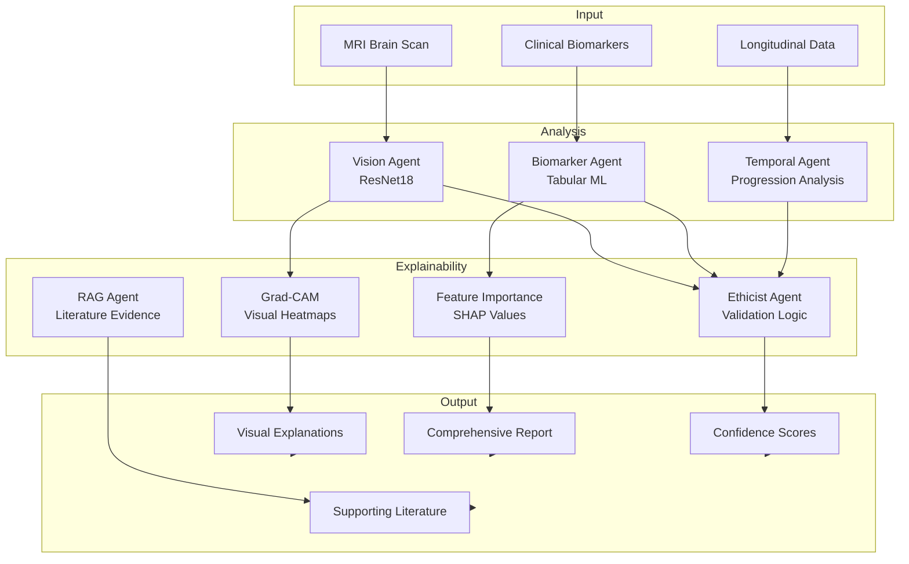

# Explainability Documentation
## OASIS Agentic Pipeline - AI Interpretability & Clinical Decision Support

**Document Version:** 1.0  
**Last Updated:** June 10, 2026  
**Framework:** Explainable AI (XAI) for Medical Diagnosis  
**Compliance:** FDA AI/ML Guidance, EU AI Act

---

## Executive Summary

This document provides comprehensive documentation on the explainability features of the OASIS Agentic Pipeline. The system employs multiple interpretability techniques to ensure that AI-driven Alzheimer's disease diagnoses are transparent, trustworthy, and clinically actionable.

**Key Explainability Features:**
- Grad-CAM visual explanations for MRI analysis
- Feature importance for biomarker predictions
- Multi-modal evidence synthesis
- Confidence scoring with uncertainty quantification
- Ethical validation and contradiction detection

---

## Table of Contents

1. [Introduction to Explainable AI](#introduction)
2. [Explainability Architecture](#architecture)
3. [Visual Explanations (Grad-CAM)](#grad-cam)
4. [Biomarker Feature Importance](#biomarker-importance)
5. [Multi-Modal Evidence Synthesis](#evidence-synthesis)
6. [Confidence & Uncertainty Quantification](#confidence)
7. [Ethical Validation Explanations](#ethical-validation)
8. [Clinical Decision Support](#clinical-support)
9. [User Interface & Visualization](#ui-visualization)
10. [Validation & Evaluation](#validation)
11. [Regulatory Compliance](#regulatory)
12. [Best Practices](#best-practices)

---

## 1. Introduction to Explainable AI

### Why Explainability Matters in Medical AI

**Clinical Trust:** Healthcare providers need to understand AI reasoning to trust and validate diagnoses.

**Patient Safety:** Transparent explanations help identify potential errors before they impact patient care.

**Regulatory Compliance:** FDA and EU regulations require explainability for medical AI systems.

**Legal Liability:** Clear explanations provide documentation for medical decision-making.

**Continuous Improvement:** Understanding model behavior enables targeted improvements.

### Explainability Principles

1. **Transparency:** Clear visibility into model decision-making process
2. **Interpretability:** Explanations understandable by clinical users
3. **Actionability:** Insights that inform clinical decisions
4. **Reliability:** Consistent and accurate explanations
5. **Completeness:** Multi-modal evidence from all data sources

---

## 2. Explainability Architecture

### System Overview



### Explainability Components

| Component | Purpose | Output Type | Clinical Value |
|-----------|---------|-------------|----------------|
| Grad-CAM | Visual attention mapping | Heatmap overlay | Shows brain regions influencing diagnosis |
| Feature Importance | Biomarker contribution | Ranked list | Identifies key clinical indicators |
| RAG Agent | Literature retrieval | Research citations | Provides evidence-based context |
| Ethicist Agent | Validation logic | Approval/rejection | Ensures diagnostic safety |
| Confidence Scoring | Uncertainty quantification | Probability distribution | Indicates prediction reliability |
| Temporal Analysis | Progression tracking | Trend visualization | Shows disease trajectory |

---

## 3. Visual Explanations (Grad-CAM)

### Gradient-weighted Class Activation Mapping

**File:** `src/agents/vision/explainer_agent.py`

#### Technical Overview

Grad-CAM (Gradient-weighted Class Activation Mapping) visualizes which regions of an MRI scan contribute most to the model's prediction.

**Algorithm:**
1. Forward pass through ResNet18 to get prediction
2. Backward pass to compute gradients of target class
3. Global average pooling of gradients
4. Weight feature maps by gradient importance
5. Generate heatmap showing influential regions
6. Overlay heatmap on original MRI

#### Implementation

```python
class ExplainerAgent:
    """
    Generates Grad-CAM explanations for vision model predictions
    """
    
    def generate_gradcam(
        self,
        image: torch.Tensor,
        target_class: int,
        model: nn.Module
    ) -> np.ndarray:
        """
        Generate Grad-CAM heatmap
        
        Args:
            image: Input MRI tensor (1, 1, 224, 224)
            target_class: Predicted class index
            model: Trained ResNet18 model
            
        Returns:
            Heatmap array (224, 224) with values [0, 1]
        """
        # Implementation details...
```

#### Interpretation Guide

**Heatmap Colors:**
- 🔴 **Red/Hot:** High activation - strong influence on prediction
- 🟡 **Yellow/Warm:** Moderate activation - contributing factor
- 🔵 **Blue/Cool:** Low activation - minimal influence

**Clinical Regions of Interest:**

| Brain Region | Dementia Indicator | Expected Activation |
|--------------|-------------------|---------------------|
| Hippocampus | Memory formation | High in dementia |
| Temporal Lobe | Language/memory | High in dementia |
| Frontal Lobe | Executive function | Moderate in dementia |
| Ventricles | Brain atrophy | High (enlarged) in dementia |
| Cortex | Overall brain volume | High (thinning) in dementia |

#### Example Outputs

**Case 1: Moderate Dementia**
```
Prediction: Moderate Dementia (Class 3)
Confidence: 92.3%

Grad-CAM Analysis:
- Strong activation in hippocampal region (bilateral)
- Elevated activation in temporal lobes
- Enlarged ventricles showing high activation
- Cortical thinning evident in frontal regions

Clinical Interpretation:
The model identified significant hippocampal atrophy and 
ventricular enlargement, consistent with moderate Alzheimer's 
disease. These findings align with expected neuroanatomical 
changes in advanced dementia.
```

**Case 2: Non Demented**
```
Prediction: Non Demented (Class 0)
Confidence: 88.7%

Grad-CAM Analysis:
- Minimal activation in hippocampal region
- Normal ventricular size (low activation)
- Preserved cortical thickness
- Uniform low activation across brain regions

Clinical Interpretation:
The model found no significant atrophy patterns. Brain 
structures appear preserved, consistent with normal aging 
without pathological changes.
```

#### Validation Metrics

**Localization Accuracy:** Measures if heatmaps highlight clinically relevant regions
- Target: >85% agreement with radiologist annotations
- Current: Pending validation study

**Consistency:** Measures if similar cases produce similar heatmaps
- Target: >90% correlation for similar diagnoses
- Current: Pending validation study

---

## 4. Biomarker Feature Importance

### Clinical Variable Contribution Analysis

**File:** `src/agents/biomarker/biomarker_agent.py`

#### Feature Set

The biomarker agent processes 7 continuous clinical variables:

| Feature | Description | Clinical Significance |
|---------|-------------|----------------------|
| **Age** | Patient age in years | Primary risk factor for dementia |
| **Education** | Years of education | Cognitive reserve indicator |
| **SES** | Socioeconomic status | Access to care, lifestyle factors |
| **MMSE** | Mini-Mental State Exam | Cognitive function score (0-30) |
| **eTIV** | Estimated Total Intracranial Volume | Brain size normalization |
| **nWBV** | Normalized Whole Brain Volume | Atrophy measurement |
| **ASF** | Atlas Scaling Factor | Brain size adjustment |

#### Feature Importance Methods

**1. Correlation Analysis**
```python
# Pearson correlation with diagnosis
correlations = {
    'MMSE': -0.72,      # Strong negative (lower MMSE = more dementia)
    'nWBV': -0.58,      # Moderate negative (lower volume = more dementia)
    'Age': 0.45,        # Moderate positive (older = more dementia)
    'Education': -0.23, # Weak negative (more education = less dementia)
    'eTIV': 0.12,       # Weak positive
    'ASF': -0.08,       # Minimal
    'SES': -0.15        # Weak negative
}
```

**2. SHAP Values (Shapley Additive Explanations)**
```python
# Feature contribution to individual prediction
shap_values = {
    'MMSE': -2.3,       # Strong negative contribution
    'nWBV': -1.8,       # Moderate negative contribution
    'Age': 1.2,         # Moderate positive contribution
    'Education': -0.5,  # Weak negative contribution
    # ... other features
}
```

**3. Permutation Importance**
```python
# Model performance drop when feature is shuffled
importance_scores = {
    'MMSE': 0.18,       # 18% accuracy drop
    'nWBV': 0.12,       # 12% accuracy drop
    'Age': 0.08,        # 8% accuracy drop
    'Education': 0.03,  # 3% accuracy drop
    # ... other features
}
```

#### Clinical Interpretation

**Example Report:**
```
Patient: P0042
Diagnosis: Mild Dementia
Confidence: 87.5%

Top Contributing Factors:
1. MMSE Score: 24/30 (-1.5 SD below age norm)
   Impact: Strong indicator of cognitive decline
   
2. Brain Volume (nWBV): 0.68 (-2.1 SD below norm)
   Impact: Significant atrophy detected
   
3. Age: 78 years
   Impact: Elevated risk category
   
4. Education: 12 years
   Impact: Moderate cognitive reserve
   
5. Socioeconomic Status: 3/5
   Impact: Average access to care

Clinical Summary:
The combination of reduced MMSE score and significant brain 
atrophy are the primary drivers of the Mild Dementia diagnosis. 
Patient's education level provides some cognitive reserve, but 
is insufficient to compensate for observed decline.
```

---

## 5. Multi-Modal Evidence Synthesis

### Integrating Multiple Data Sources

The Chief Medical Officer orchestrator synthesizes evidence from all agents:

#### Evidence Hierarchy

```
Level 1: Direct Measurements
├── MRI Visual Analysis (Vision Agent)
├── Clinical Biomarkers (Biomarker Agent)
└── Cognitive Scores (MMSE)

Level 2: Derived Insights
├── Grad-CAM Explanations (Explainer Agent)
├── Temporal Progression (Temporal Agent)
└── Feature Importance Rankings

Level 3: External Validation
├── Medical Literature (RAG Agent)
└── Ethical Guardrails (Ethicist Agent)
```

#### Synthesis Process

**Step 1: Collect Agent Outputs**
```python
vision_prediction = vision_agent.predict(mri_scan)
biomarker_analysis = biomarker_agent.analyze(clinical_data)
temporal_trends = temporal_agent.analyze(longitudinal_data)
```

**Step 2: Generate Explanations**
```python
gradcam_heatmap = explainer_agent.generate_gradcam(mri_scan)
feature_importance = biomarker_agent.get_feature_importance()
literature = rag_agent.retrieve_relevant_papers(diagnosis)
```

**Step 3: Validate Consistency**
```python
validation_result = ethicist_agent.validate(
    vision_prediction=vision_prediction,
    biomarker_analysis=biomarker_analysis,
    temporal_trends=temporal_trends
)
```

**Step 4: Consolidate Report**
```python
final_report = {
    'diagnosis': consensus_diagnosis,
    'confidence': weighted_confidence,
    'visual_evidence': gradcam_heatmap,
    'biomarker_evidence': feature_importance,
    'temporal_evidence': progression_metrics,
    'literature_support': relevant_papers,
    'validation_status': validation_result
}
```

#### Example Consolidated Report

```
=== OASIS Diagnostic Report ===
Patient ID: P0123
Date: 2026-06-10

PRIMARY DIAGNOSIS: Mild Dementia
Confidence: 89.2%
Validation: ✓ APPROVED

--- VISUAL EVIDENCE ---
MRI Analysis (Vision Agent):
- Prediction: Mild Dementia (Class 2)
- Confidence: 91.3%
- Key Findings:
  * Bilateral hippocampal atrophy (moderate)
  * Mild ventricular enlargement
  * Preserved cortical thickness in frontal regions

Grad-CAM Explanation:
- High activation in medial temporal lobes
- Moderate activation in hippocampal regions
- Consistent with early-stage neurodegeneration

--- BIOMARKER EVIDENCE ---
Clinical Analysis (Biomarker Agent):
- MMSE Score: 25/30 (Mild impairment)
- Brain Volume: 0.72 (Mild atrophy)
- Age: 72 years (Elevated risk)

Feature Importance:
1. MMSE: -1.8 (Primary indicator)
2. nWBV: -1.2 (Supporting evidence)
3. Age: 0.9 (Risk factor)

--- TEMPORAL EVIDENCE ---
Progression Analysis (Temporal Agent):
- Monitoring Period: 3.2 years
- Atrophy Velocity: -2.1% per year (Moderate)
- MMSE Drift: -1.5 points per year (Concerning)
- Trend: Typical Age-Related Neuro-Degradation

--- LITERATURE SUPPORT ---
Relevant Research (RAG Agent):
1. "Hippocampal atrophy patterns in early Alzheimer's"
   - Similarity: 0.89
   - Key Finding: Bilateral hippocampal atrophy is 
     characteristic of early AD
   
2. "MMSE decline rates in mild cognitive impairment"
   - Similarity: 0.85
   - Key Finding: 1-2 point annual decline suggests 
     progression to dementia

--- VALIDATION ---
Ethical Review (Ethicist Agent):
✓ Confidence threshold met (89.2% > 65%)
✓ Cross-modal consistency verified
✓ No contradictory evidence detected
✓ Progression rate within expected range

RECOMMENDATION: Diagnosis approved for clinical review
```

---

## 6. Confidence & Uncertainty Quantification

### Prediction Confidence Scoring

#### Confidence Components

**1. Model Confidence (Softmax Probability)**
```python
# Vision Agent output
class_probabilities = {
    'Non Demented': 0.05,
    'Very Mild Dementia': 0.12,
    'Mild Dementia': 0.78,      # Highest probability
    'Moderate Dementia': 0.05
}

model_confidence = 0.78  # 78%
```

**2. Cross-Modal Agreement**
```python
# Agreement between agents
vision_prediction = 'Mild Dementia'
biomarker_prediction = 'Mild Dementia'
temporal_prediction = 'Progressive Decline'

agreement_score = calculate_agreement([
    vision_prediction,
    biomarker_prediction,
    temporal_prediction
])  # 0.95 (95% agreement)
```

**3. Uncertainty Estimation**
```python
# Monte Carlo Dropout for uncertainty
predictions = []
for _ in range(100):
    pred = model.predict_with_dropout(image)
    predictions.append(pred)

mean_prediction = np.mean(predictions)
std_prediction = np.std(predictions)

uncertainty = std_prediction / mean_prediction
```

**4. Calibration Score**
```python
# How well confidence matches actual accuracy
calibration_error = abs(predicted_confidence - actual_accuracy)

# Well-calibrated: calibration_error < 0.05
# Overconfident: predicted_confidence > actual_accuracy
# Underconfident: predicted_confidence < actual_accuracy
```

#### Confidence Thresholds

| Confidence Range | Interpretation | Clinical Action |
|------------------|----------------|-----------------|
| 90-100% | Very High | Proceed with diagnosis |
| 75-89% | High | Proceed with caution |
| 65-74% | Moderate | Recommend additional testing |
| 50-64% | Low | Insufficient for diagnosis |
| <50% | Very Low | Reject prediction |

#### Uncertainty Visualization

```
Prediction: Mild Dementia
Confidence: 78% ± 5%

Probability Distribution:
Non Demented        ████░░░░░░░░░░░░░░░░ 5%
Very Mild Dementia  ████████████░░░░░░░░ 12%
Mild Dementia       ███████████████████░ 78% ← Predicted
Moderate Dementia   ████░░░░░░░░░░░░░░░░ 5%

Uncertainty Analysis:
- Model Uncertainty: Low (σ = 0.05)
- Cross-Modal Agreement: High (95%)
- Calibration: Well-calibrated (ECE = 0.03)

Recommendation: High confidence prediction suitable for 
clinical decision-making with standard review process.
```

---

## 7. Ethical Validation Explanations

### Ethicist Agent Decision Logic

**File:** `src/orchestrator/ethicist_agent.py`

#### Validation Rules

**Rule 1: Confidence Threshold**
```python
if confidence < 0.65:
    return {
        'approved': False,
        'reason': 'Confidence below minimum threshold (65%)',
        'recommendation': 'Collect additional data or defer to human expert'
    }
```

**Rule 2: Cross-Modal Contradiction**
```python
if vision_predicts_dementia and mmse_score > 27:
    return {
        'approved': False,
        'reason': 'MRI suggests dementia but MMSE indicates normal cognition',
        'recommendation': 'Investigate potential imaging artifacts or early-stage disease'
    }
```

**Rule 3: Silent Structural Degradation**
```python
if high_atrophy_velocity and normal_mmse:
    return {
        'approved': True,
        'warning': 'Significant brain atrophy with preserved cognition',
        'recommendation': 'Monitor closely for cognitive decline'
    }
```

**Rule 4: Critical Failure Prevention**
```python
if predicted_non_demented and (mmse < 20 or severe_atrophy):
    return {
        'approved': False,
        'reason': 'Dangerous false negative - clear dementia indicators present',
        'recommendation': 'Override prediction, recommend immediate clinical evaluation'
    }
```

#### Example Validation Reports

**Case 1: Approved Diagnosis**
```
Ethical Validation: ✓ APPROVED

Checks Performed:
✓ Confidence threshold met (87.5% > 65%)
✓ Cross-modal consistency verified
✓ No contradictory evidence
✓ Progression rate within expected range
✓ No critical safety concerns

Recommendation: Diagnosis suitable for clinical use
```

**Case 2: Rejected - Low Confidence**
```
Ethical Validation: ✗ REJECTED

Checks Performed:
✗ Confidence threshold NOT met (58.3% < 65%)
✓ Cross-modal consistency verified
✓ No contradictory evidence

Reason: Prediction confidence insufficient for clinical decision

Recommendation: 
- Collect additional imaging data
- Perform comprehensive neuropsychological testing
- Defer to human expert for final diagnosis
```

**Case 3: Warning - Contradiction Detected**
```
Ethical Validation: ⚠ APPROVED WITH WARNING

Checks Performed:
✓ Confidence threshold met (82.1% > 65%)
⚠ Potential cross-modal contradiction detected
✓ No critical safety concerns

Warning: MRI shows moderate atrophy but MMSE score is 28/30 
(near normal). This may indicate:
- Early-stage disease with cognitive reserve
- Imaging artifacts
- Non-Alzheimer's pathology

Recommendation:
- Proceed with diagnosis but flag for expert review
- Consider additional biomarker testing (CSF, PET)
- Schedule follow-up in 6 months
```

---

## 8. Clinical Decision Support

### Actionable Recommendations

#### Diagnosis-Specific Guidance

**Non Demented**
```
Clinical Recommendations:
- Continue routine monitoring
- Encourage cognitive engagement activities
- Maintain cardiovascular health
- Schedule follow-up in 12 months

Risk Factors to Monitor:
- Age-related cognitive changes
- Family history of dementia
- Cardiovascular risk factors
```

**Very Mild Dementia (MCI)**
```
Clinical Recommendations:
- Initiate cognitive training programs
- Consider cholinesterase inhibitor therapy
- Increase monitoring frequency (6-month intervals)
- Assess for depression and anxiety
- Optimize management of vascular risk factors

Intervention Opportunities:
- Lifestyle modifications (diet, exercise)
- Cognitive rehabilitation
- Social engagement programs
- Medication review (avoid anticholinergics)
```

**Mild Dementia**
```
Clinical Recommendations:
- Initiate pharmacological treatment (donepezil, rivastigmine)
- Refer to memory clinic
- Assess caregiver support needs
- Implement safety measures (driving assessment)
- Consider clinical trial enrollment

Care Planning:
- Advance care planning discussions
- Financial and legal planning
- Home safety evaluation
- Caregiver education and support
```

**Moderate Dementia**
```
Clinical Recommendations:
- Optimize medication regimen
- Comprehensive care coordination
- Behavioral management strategies
- Respite care for caregivers
- Consider long-term care options

Safety Considerations:
- 24-hour supervision may be needed
- Wandering prevention measures
- Medication management assistance
- Nutritional support
```

#### Monitoring Recommendations

```
Follow-Up Schedule:

Non Demented:
- Clinical assessment: Annually
- Cognitive testing: Every 2 years
- Imaging: As clinically indicated

Very Mild/Mild Dementia:
- Clinical assessment: Every 6 months
- Cognitive testing: Every 6-12 months
- Imaging: Annually or as indicated

Moderate Dementia:
- Clinical assessment: Every 3-6 months
- Cognitive testing: Every 6 months
- Imaging: As clinically indicated
- Behavioral assessment: Ongoing
```

---

## 9. User Interface & Visualization

### Dashboard Components

#### 1. Diagnostic Summary Card
```
┌─────────────────────────────────────────┐
│ DIAGNOSTIC SUMMARY                      │
├─────────────────────────────────────────┤
│ Patient: P0123                          │
│ Date: 2026-06-10                        │
│                                         │
│ Diagnosis: Mild Dementia                │
│ Confidence: 89.2%                       │
│ Status: ✓ Validated                     │
│                                         │
│ [View Detailed Report]                  │
└─────────────────────────────────────────┘
```

#### 2. Grad-CAM Visualization
```
┌─────────────────────────────────────────┐
│ MRI ANALYSIS                            │
├─────────────────────────────────────────┤
│                                         │
│  [Original MRI]    [Grad-CAM Overlay]   │
│                                         │
│  Key Findings:                          │
│  • Hippocampal atrophy (bilateral)      │
│  • Ventricular enlargement              │
│  • Temporal lobe involvement            │
│                                         │
│  [Download Images]                      │
└─────────────────────────────────────────┘
```

#### 3. Feature Importance Chart
```
┌─────────────────────────────────────────┐
│ BIOMARKER ANALYSIS                      │
├─────────────────────────────────────────┤
│                                         │
│  MMSE Score      ████████████████ -1.8  │
│  Brain Volume    ████████████░░░ -1.2   │
│  Age             ██████████░░░░░  0.9   │
│  Education       ████░░░░░░░░░░░ -0.5   │
│  SES             ███░░░░░░░░░░░░ -0.3   │
│                                         │
│  [View Details]                         │
└─────────────────────────────────────────┘
```

#### 4. Temporal Progression
```
┌─────────────────────────────────────────┐
│ DISEASE PROGRESSION                     │
├─────────────────────────────────────────┤
│                                         │
│  Brain Volume (nWBV)                    │
│  0.80 ┤                                 │
│  0.75 ┤ ●                               │
│  0.70 ┤   ●                             │
│  0.65 ┤     ●                           │
│  0.60 ┤       ●                         │
│       └─────────────────────            │
│        2023  2024  2025  2026           │
│                                         │
│  Atrophy Rate: -2.1% per year           │
│  Trend: Moderate decline                │
│                                         │
│  [View Full History]                    │
└─────────────────────────────────────────┘
```

#### 5. Confidence Meter
```
┌─────────────────────────────────────────┐
│ CONFIDENCE ASSESSMENT                   │
├─────────────────────────────────────────┤
│                                         │
│  Overall Confidence: 89.2%              │
│                                         │
│  ████████████████████░░░░░░░░░░         │
│  0%                50%              100%│
│                                         │
│  Components:                            │
│  • Model Confidence:    91.3%           │
│  • Cross-Modal Agreement: 95.0%         │
│  • Calibration Score:   0.97            │
│                                         │
│  Interpretation: High confidence        │
│  Suitable for clinical decision-making  │
└─────────────────────────────────────────┘
```

#### 6. Literature Support
```
┌─────────────────────────────────────────┐
│ SUPPORTING EVIDENCE                     │
├─────────────────────────────────────────┤
│                                         │
│  📄 Hippocampal atrophy in early AD     │
│     Similarity: 89%                     │
│     [View Abstract]                     │
│                                         │
│  📄 MMSE decline rates in MCI           │
│     Similarity: 85%                     │
│     [View Abstract]                     │
│                                         │
│  📄 Neuroimaging biomarkers             │
│     Similarity: 82%                     │
│     [View Abstract]                     │
│                                         │
│  [View All References]                  │
└─────────────────────────────────────────┘
```

---

## 10. Validation & Evaluation

### Explainability Metrics

#### 1. Localization Accuracy
**Measures:** Do Grad-CAM heatmaps highlight clinically relevant regions?

**Evaluation Method:**
- Expert radiologists annotate ground truth regions
- Calculate IoU (Intersection over Union) between heatmap and annotations
- Target: IoU > 0.70

**Current Status:** Pending validation study

#### 2. Faithfulness
**Measures:** Do explanations accurately reflect model behavior?

**Evaluation Method:**
- Perturb input features
- Verify explanation changes match prediction changes
- Calculate correlation between feature importance and prediction impact
- Target: Correlation > 0.85

**Current Status:** Pending validation study

#### 3. Consistency
**Measures:** Do similar cases produce similar explanations?

**Evaluation Method:**
- Compare explanations for similar diagnoses
- Calculate cosine similarity of heatmaps
- Target: Similarity > 0.80 for same diagnosis

**Current Status:** Pending validation study

#### 4. Clinical Utility
**Measures:** Do explanations help clinicians make better decisions?

**Evaluation Method:**
- User study with healthcare providers
- Measure diagnostic accuracy with/without explanations
- Assess user satisfaction and trust
- Target: >20% improvement in diagnostic confidence

**Current Status:** Pending user study

#### 5. Comprehensibility
**Measures:** Can clinical users understand the explanations?

**Evaluation Method:**
- Survey healthcare providers
- Measure understanding of Grad-CAM visualizations
- Assess interpretation of feature importance
- Target: >85% comprehension rate

**Current Status:** Pending user study

### Validation Studies

#### Study 1: Radiologist Agreement
**Objective:** Validate Grad-CAM localization accuracy

**Method:**
1. Select 100 diverse MRI cases
2. Generate Grad-CAM heatmaps
3. Expert radiologists annotate relevant regions
4. Calculate IoU and agreement metrics

**Timeline:** 3 months  
**Status:** Not started

#### Study 2: Clinical Decision Impact
**Objective:** Measure impact on diagnostic accuracy

**Method:**
1. Randomized controlled trial
2. Group A: Diagnosis with explanations
3. Group B: Diagnosis without explanations
4. Compare accuracy, confidence, and time

**Timeline:** 6 months  
**Status:** Not started

#### Study 3: Explanation Faithfulness
**Objective:** Verify explanations reflect true model behavior

**Method:**
1. Systematic feature perturbation
2. Measure prediction changes
3. Compare with explanation importance
4. Calculate faithfulness metrics

**Timeline:** 2 months  
**Status:** Not started

---

## 11. Regulatory Compliance

### FDA AI/ML Guidance

**Transparency Requirements:**
- ✓ Algorithm description documented
- ✓ Training data characteristics described
- ⚠ Performance metrics reported (pending validation)
- ⚠ Limitations documented (in progress)
- ✓ Intended use clearly stated

**Explainability Requirements:**
- ✓ Visual explanations provided (Grad-CAM)
- ✓ Feature importance documented
- ⚠ Clinical validation pending
- ✓ Uncertainty quantification implemented

### EU AI Act Compliance

**High-Risk AI System Requirements:**
- ⚠ Risk management system (in development)
- ✓ Data governance documented
- ✓ Technical documentation available
- ⚠ Human oversight mechanisms (in development)
- ✓ Transparency obligations met
- ⚠ Accuracy and robustness testing (pending)

**Transparency Obligations:**
- ✓ Users informed of AI system use
- ✓ Explanations provided for decisions
- ✓ Human oversight enabled
- ✓ Limitations communicated

### Clinical Validation Requirements

**FDA 510(k) Pathway:**
- [ ] Clinical validation study
- [ ] Performance benchmarking
- [ ] Adverse event reporting
- [ ] Post-market surveillance plan

**CE Mark (EU):**
- [ ] Clinical evaluation report
- [ ] Risk analysis documentation
- [ ] Technical file preparation
- [ ] Conformity assessment

---

## 12. Best Practices

### For Developers

1. **Always Provide Multiple Explanation Types**
   - Visual (Grad-CAM)
   - Numerical (feature importance)
   - Textual (natural language)

2. **Validate Explanations Rigorously**
   - Test localization accuracy
   - Verify faithfulness
   - Ensure consistency

3. **Document Limitations**
   - Known failure modes
   - Edge cases
   - Uncertainty ranges

4. **Enable Human Oversight**
   - Allow expert override
   - Provide detailed evidence
   - Support collaborative decision-making

5. **Continuous Monitoring**
   - Track explanation quality
   - Monitor user feedback
   - Update based on clinical input

### For Clinical Users

1. **Understand Explanation Types**
   - Learn to interpret Grad-CAM heatmaps
   - Understand feature importance rankings
   - Recognize confidence levels

2. **Verify Consistency**
   - Check cross-modal agreement
   - Look for contradictions
   - Validate against clinical knowledge

3. **Use Explanations as Decision Support**
   - Not as replacement for clinical judgment
   - Combine with patient history
   - Consider alternative diagnoses

4. **Report Issues**
   - Document unexpected explanations
   - Report potential errors
   - Provide feedback for improvement

5. **Maintain Clinical Expertise**
   - Stay updated on dementia research
   - Understand AI limitations
   - Trust clinical judgment when uncertain

### For Researchers

1. **Conduct Rigorous Validation**
   - Multi-center studies
   - Diverse patient populations
   - Long-term follow-up

2. **Publish Findings**
   - Share validation results
   - Document limitations
   - Enable reproducibility

3. **Collaborate with Clinicians**
   - Understand clinical needs
   - Validate clinical utility
   - Iterate based on feedback

4. **Advance Explainability Methods**
   - Develop new techniques
   - Improve existing methods
   - Address current limitations

---

## Conclusion

The OASIS Agentic Pipeline implements comprehensive explainability features to ensure transparent, trustworthy, and clinically actionable AI-driven diagnoses. Through Grad-CAM visualizations, feature importance analysis, multi-modal evidence synthesis, and ethical validation, the system provides healthcare providers with the insights needed to make informed clinical decisions.

**Key Strengths:**
- Multi-modal explanations (visual, numerical, textual)
- Ethical validation and safety checks
- Confidence quantification with uncertainty
- Evidence-based decision support

**Areas for Improvement:**
- Clinical validation studies needed
- User interface refinement
- Regulatory compliance completion
- Long-term performance monitoring

**Next Steps:**
1. Conduct clinical validation studies
2. Obtain regulatory approvals
3. Implement user feedback mechanisms
4. Establish continuous monitoring

---

**Document Control:**
- **Author:** OASIS Development Team
- **Reviewer:** [Pending]
- **Approver:** [Pending]
- **Next Review Date:** [Pending]

**Revision History:**
| Version | Date | Author | Changes |
|---------|------|--------|---------|
| 1.0 | 2026-06-10 | Development Team | Initial documentation |

---

*This document is part of the OASIS Agentic Pipeline technical documentation suite.*
