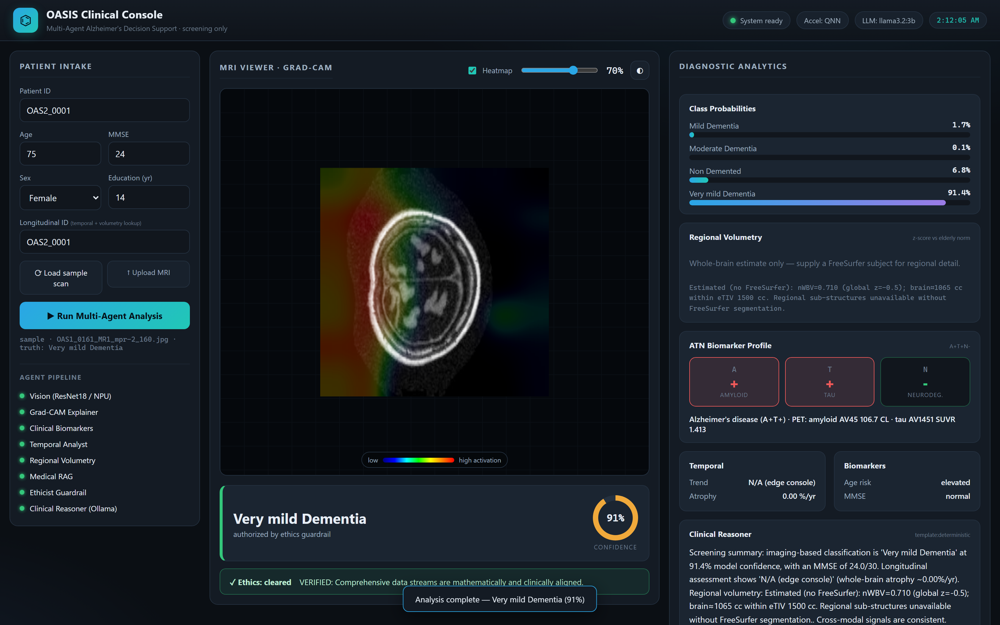
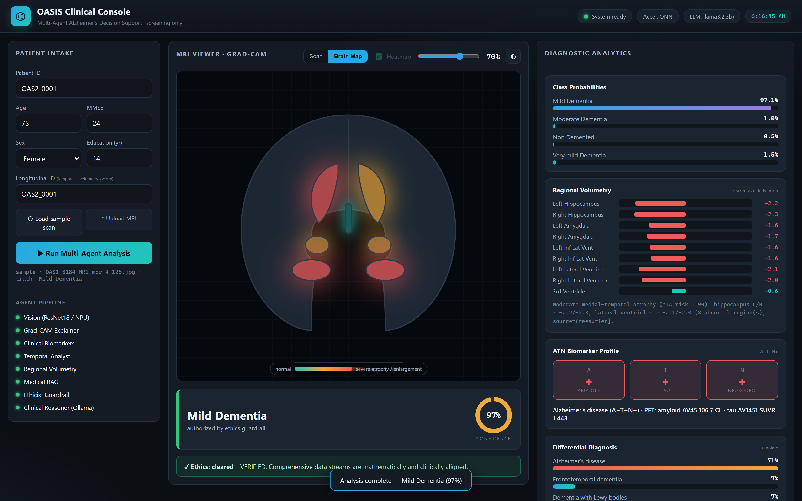

# OASIS Agentic Pipeline

**Advanced Multi-Agent AI System for Alzheimer's Disease Diagnosis**

[](https://www.python.org/downloads/)
[](https://pytorch.org/)
[](LICENSE)

---

## 🧠 Overview

The OASIS Agentic Pipeline is a sophisticated heterogeneous swarm intelligence system that orchestrates **12 specialized AI agents** to provide comprehensive, explainable, and ethically-validated Alzheimer's disease screening. It is a **hybrid agentic system**: a free local **Ollama** tier handles tasks it does as well, while the complex clinical reasoning (differential diagnosis, cure-research hypothesis generation) runs on **Claude via `ANTHROPIC_API_KEY`** on a **cost-tiered** basis (Haiku → Sonnet → Opus). Hardware inference is tuned for **Windows on ARM64 / Snapdragon NPU**. It adds **regional brain volumetry** + **ATN biomarker staging** from OASIS-3/4 derivatives, an **interactive brain map** where regions glow with pathology, a **cure-research lab** that mines the cohort for treatment/prevention clues, and a **production radiology-grade web console** that runs on any device — including hospital displays and TVs.

> 📐 [EDGE_CLOUD_ARCHITECTURE.md](EDGE_CLOUD_ARCHITECTURE.md) — hybrid edge-cloud / NPU design and the LLM routing tiers.
> 🧪 [ADVANCED_ANALYTICS.md](ADVANCED_ANALYTICS.md) — diagnostic analyses the OASIS data supports (ATN, Centiloid, BrainAGE, progression).
> 📊 [docs/OASIS_Pipeline_Effectiveness_Analysis.pdf](docs/OASIS_Pipeline_Effectiveness_Analysis.pdf) — generated effectiveness report.




### Key Features

- 🔬 **Multi-Modal Analysis**: Integrates MRI imaging, clinical biomarkers, longitudinal data, and regional volumetry
- 🧠 **Regional Volumetry**: FreeSurfer `aseg` parsing → eTIV-normalized z-scores + medial-temporal-atrophy risk
- ⚡ **Snapdragon NPU-Optimized**: ONNX Runtime **QNN → DirectML → CPU** auto-fallback for Windows ARM64
- 🤖 **Local LLM Reasoning**: Ollama-backed Clinical Reasoner (edge-first, optional self-hosted cloud) — **zero paid API keys**
- 🎯 **Explainable AI**: Grad-CAM heatmaps for visual interpretation of model decisions
- 🛡️ **Ethical Guardrails**: Built-in compliance agent prevents unsafe or contradictory diagnoses
- 📚 **RAG-Enhanced**: Medical literature retrieval for evidence-based decision support
- 🗂️ **OASIS-3 / OASIS-4 Ingestion**: Vendored NITRC download scripts (scans, FreeSurfer, PUP) + ARM64 PowerShell wrapper
- 📊 **Effectiveness Analysis**: One-command, reproducible PDF report (Pillow-rendered, no matplotlib)
- 🌐 **Interactive Dashboard**: Streamlit-based web interface for real-time diagnostics

---

## 🏗️ Architecture

### Agent Ecosystem

```
┌─────────────────────────────────────────────────────────────┐
│           Chief Medical Officer (Orchestrator)              │
└─────────────────────────────────────────────────────────────┘
                            │
        ┌───────────────────┼───────────────────┐
        │                   │                   │
    ┌───▼───┐          ┌────▼────┐        ┌────▼────┐
    │Agent 1│          │ Agent 2 │        │ Agent 3 │
    │Vision │          │Biomarker│        │   RAG   │
    │ResNet │          │Clinical │        │Librarian│
    └───┬───┘          └────┬────┘        └────┬────┘
        │                   │                   │
    ┌───▼───┐          ┌────▼────┐        ┌────▼────┐
    │Agent 4│          │ Agent 5 │        │ Agent 6 │
    │Grad-CAM│         │Temporal │        │Ethicist │
    │Explain│          │Analyst  │        │Guardrail│
    └───────┘          └─────────┘        └─────────┘
                            │
                       ┌────▼────┐
                       │ Agent 7 │
                       │  ONNX   │
                       │Inference│
                       └─────────┘
```

### The 12 Specialized Agents

1. **Vision Agent**: ResNet18-based MRI image classifier
2. **Biomarker Agent**: Clinical data processor with z-score normalization
3. **RAG Agent**: Medical literature retrieval using sentence transformers
4. **Explainer Agent**: Grad-CAM visualization for model interpretability
5. **Temporal Analyst**: Longitudinal progression tracking and velocity metrics
6. **Ethicist Agent**: Compliance guardrails and cross-modal validation
7. **ONNX Agent**: NPU-optimized INT8 inference (QNN → DirectML → CPU)
8. **Clinical Reasoner**: Hybrid narrator — free Ollama for routine cases, Claude (standard tier) for flagged/low-confidence
9. **Regional Volumetry Analyst**: FreeSurfer `aseg` regional volumes → normative z-scores + MTA risk
10. **ATN Biomarker Profiler**: Amyloid/Tau/Neurodegeneration staging (NIA-AA framework, Centiloid)
11. **Differential Diagnosis Reasoner** *(new)*: Claude (deep tier) ranked differential across dementia etiologies + work-up
12. **Therapeutic Insight Reasoner** *(new)*: Claude (deep tier) cure-research hypotheses grounded on the cohort-mining engine

> Tasks a small local model does as well (grounded summaries, structured labels) run **free on Ollama**; the genuinely hard reasoning (Agents 11–12) runs on **Claude** with cost-tiered model selection. Everything degrades gracefully to Ollama → deterministic templates when no key/daemon is present.

---

## 🚀 Quick Start

### Prerequisites

- Python 3.14 or higher
- 8GB RAM minimum (16GB+ recommended)
- Optional: NVIDIA GPU with CUDA support (6GB+ VRAM)

### Installation

1. **Clone the repository:**
```bash
git clone https://github.com/hakeemadeniji/oasis-agentic-pipeline.git
cd oasis-agentic-pipeline
```

2. **Create virtual environment:**
```bash
python -m venv .venv

# Windows
.venv\Scripts\activate

# Linux/Mac
source .venv/bin/activate
```

3. **Install dependencies:**
```bash
pip install -r requirements.txt
```

4. **Verify installation:**
```bash
python -c "import torch; print(f'PyTorch: {torch.__version__}'); print(f'CUDA: {torch.cuda.is_available()}')"
```

### Running the System

#### Option 1: Production Clinical Console (Recommended)
```bash
uvicorn src.api.main:app --host 0.0.0.0 --port 8000      # full service
# or, dependency-light edge console:
python scripts/console_server.py --port 8800
```
Access the console at `http://localhost:8000/app/` (or `:8800/app/`). See
[Production Clinical Console](#️-production-clinical-console-radiology-grade-web-ui).

#### Option 1b: Streamlit Dashboard (legacy demo)
```bash
streamlit run src/orchestrator/dashboard.py
```
Access at: `http://localhost:8501`

#### Option 2: Terminal Interface
```bash
python src/orchestrator/terminal_cmo.py
```

#### Option 3: Python API
```python
from orchestrator.chief_medical_officer import AdvancedChiefMedicalOfficer

# Initialize
cmo = AdvancedChiefMedicalOfficer(workspace_root="/path/to/project")

# Execute diagnosis
cmo.execute_comprehensive_diagnosis(
    patient_idx=0,
    image_path="data/oasis_raw/Non Demented/image.jpg",
    mock_subject_id="OAS2_0001"
)
```

---

## ⚡ Edge & Hybrid-Cloud Setup (Snapdragon NPU + Ollama)

### 1. Enable the Snapdragon NPU (optional but recommended)
```powershell
pip uninstall onnxruntime
pip install onnxruntime-qnn        # Qualcomm Hexagon NPU
# or: pip install onnxruntime-directml   # ARM64 GPU fallback
```
The pipeline auto-selects `QNN → DirectML → CPU` at runtime and logs which
silicon served inference. No code change required.

### 2. Set up the hybrid LLM tiers
Free local tier (Ollama) for routine tasks:
```powershell
./scripts/setup_ollama.ps1         # installs Ollama + pulls llama3.2:3b
```
```bash
./scripts/setup_ollama.sh          # Linux / Git Bash
```
Claude tier for the complex reasoning (Agents 11–12) — set your key in `.env`:
```bash
ANTHROPIC_API_KEY=sk-ant-...
ANTHROPIC_MODEL_CHEAP=claude-haiku-4-5      # structured/labels
ANTHROPIC_MODEL_STANDARD=claude-sonnet-4-6  # clinical synthesis
ANTHROPIC_MODEL_DEEP=claude-opus-4-8        # differential dx + cure-research
PREFER_FREE_WHEN_CAPABLE=true               # prefer free Ollama where it suffices
```
Without a key the system still runs (Ollama → deterministic fallback); with it,
hard reasoning escalates to Claude at the tier you choose for cost control.

### 3. Download real OASIS-3 / OASIS-4 data (NITRC username: `hakeemadeniji`)
```powershell
cd scripts\oasis
# FreeSurfer derivatives feed the Regional Volumetry agent:
./Download-Oasis.ps1 -Type freesurfer -InputCsv examples\freesurfer_ids.csv -OutDir ..\..\data\oasis_freesurfer -Native
```
```bash
cd scripts/oasis
./download_oasis_freesurfer_tar.sh examples/freesurfer_ids.csv ../../data/oasis_freesurfer hakeemadeniji
```
See [scripts/oasis/README.md](scripts/oasis/README.md) for all four scripts
(scans, freesurfer, pup, pup partial-match).

### 4. Generate the effectiveness PDF report
```bash
python src/pipeline/evaluation/effectiveness_report.py --max-per-class 60
# -> docs/OASIS_Pipeline_Effectiveness_Analysis.pdf
```

### 5. (Re)train the vision agent with class balancing
The bundled OASIS slices are heavily imbalanced; the balanced trainer fixes the
majority-class collapse and backs up prior weights:
```bash
python src/pipeline/train_balanced.py --per-class 400 --epochs 6
```

### 6. Export the NPU INT8 artifacts
```bash
python src/pipeline/onnx_inference/export_vision_onnx.py    # vision classifier -> INT8
python src/pipeline/onnx_inference/compile_npu.py           # multimodal fusion -> INT8
```

---

## 🖥️ Production Clinical Console (radiology-grade web UI)

A production web console replaces the Streamlit demo as the primary interface:
MRI viewer with adjustable **Grad-CAM overlay**, color-coded verdict + confidence
ring, ethics banner, class-probability bars, **regional volumetry z-scores**,
**ATN biomarker profile**, and the Ollama reasoner narrative. It is a
dependency-free static SPA (vanilla JS/CSS — no CDN), so it runs on any browser
and is responsive from a laptop to a **large hospital display or TV**.

**Two ways to serve it:**

```bash
# A) Full service (FastAPI + RAG + batch); console at http://localhost:8000/app/
uvicorn src.api.main:app --host 0.0.0.0 --port 8000

# B) Lightweight EDGE console (stdlib only — no transformers/RAG; ideal for a
#    Snapdragon kiosk wired to a display). Console at http://localhost:8800/app/
python scripts/console_server.py --port 8800
```

**Kiosk / unattended mode** for hospital displays & TVs — auto-loads a scan and
runs the full analysis, optionally looping:
```
http://<host>:8800/app/?auto=1          # run once on load
http://<host>:8800/app/?auto=1&loop=1   # cycle continuously (waiting-room display)
```

Cross-device: the console is plain HTML/CSS/JS served over HTTP, so any device on
the network (a second hospital monitor, a wall-mounted TV, a tablet) just opens
the URL — no install. Layout scales up automatically at ≥2200px for big screens.

---

## 📁 Project Structure

```
OASIS_AGENTIC_PIPELINE/
├── data/
│   ├── oasis_raw/                    # Raw OASIS dataset
│   │   ├── oasis_clinical_data.csv   # Cross-sectional clinical data
│   │   ├── oasis_longitudinal.csv    # Temporal tracking data
│   │   ├── Non Demented/             # Class 0 MRI images
│   │   ├── Very mild Dementia/       # Class 1 MRI images
│   │   ├── Mild Dementia/            # Class 2 MRI images
│   │   └── Moderate Dementia/        # Class 3 MRI images
│   ├── processed_tensors/            # Preprocessed data cache
│   ├── vector_store/                 # RAG embeddings
│   └── active_learning.db            # HITL queue database
│
├── src/
│   ├── agents/
│   │   ├── vision/
│   │   │   ├── vision_agent.py       # Agent 1: ResNet18 classifier
│   │   │   └── explainer_agent.py    # Agent 4: Grad-CAM explainer
│   │   ├── biomarker/
│   │   │   ├── biomarker_agent.py    # Agent 2: Clinical data processor
│   │   │   └── temporal_analyst.py   # Agent 5: Longitudinal tracker
│   │   └── rag/
│   │       └── rag_agent.py          # Agent 3: Medical librarian
│   │
│   ├── orchestrator/
│   │   ├── chief_medical_officer.py  # Main orchestrator
│   │   ├── ethicist_agent.py         # Agent 6: Compliance guardrails
│   │   ├── hitl_queue.py             # Human-in-the-loop queue
│   │   ├── dashboard.py              # Streamlit web interface
│   │   └── terminal_cmo.py           # CLI interface
│   │
│   └── pipeline/
│       ├── onnx_inference/
│       │   ├── onnx_agent.py         # Agent 7: ONNX runtime
│       │   ├── best_vision_agent.pth # Trained weights
│       │   └── multimodal_fusion_int8.onnx  # Quantized model
│       └── preprocessing/            # Data preprocessing utilities
│
├── tests/                            # Pytest suite (agents, API, bias, perf)
│
├── EDGE_CLOUD_ARCHITECTURE.md        # Hybrid edge-cloud / NPU design guide
├── REQUIREMENTS.md                   # Dependency documentation
├── API_DOCUMENTATION.md              # Interface specifications
├── TROUBLESHOOTING.md                # Problem-solving guide
├── requirements.txt                  # Python dependencies
└── README.md                         # This file
```

---

## 📊 Dataset

The system uses the **OASIS (Open Access Series of Imaging Studies)** dataset:

- **Cross-sectional data**: 416 subjects aged 18-96
- **Longitudinal data**: 373 records tracking disease progression
- **MRI scans**: T1-weighted brain images
- **Clinical variables**: Age, MMSE, education, brain volume metrics

### Required CSV Columns

**Clinical Data (`oasis_clinical_data.csv`):**
- Subject_ID, M/F, Age, Educ, SES, MMSE, eTIV, nWBV, ASF

**Longitudinal Data (`oasis_longitudinal.csv`):**
- Subject ID, Visit, MR Delay, MMSE, nWBV

---

## 🎯 Usage Examples

### Example 1: Single Patient Diagnosis
```python
from orchestrator.chief_medical_officer import AdvancedChiefMedicalOfficer

cmo = AdvancedChiefMedicalOfficer(workspace_root=".")
cmo.execute_comprehensive_diagnosis(
    patient_idx=5,
    image_path="data/oasis_raw/Mild Dementia/patient_005.jpg",
    mock_subject_id="OAS2_0005"
)
```

### Example 2: RAG Query
```python
from agents.rag.rag_agent import MedicalLibrarianAgent

agent = MedicalLibrarianAgent()
agent.ingest_medical_guidelines([
    "MMSE scores below 24 indicate cognitive impairment...",
    "Hippocampal atrophy is a key biomarker..."
])

results = agent.query("What does an MMSE of 18 mean?", top_k=2)
for doc, confidence in results:
    print(f"Confidence: {confidence:.2f} - {doc}")
```

### Example 3: Temporal Analysis
```python
from agents.biomarker.temporal_analyst import TemporalAnalystAgent

analyst = TemporalAnalystAgent("data/oasis_raw/oasis_longitudinal.csv")
metrics = analyst.calculate_progression_trajectory("OAS2_0001")

print(f"Atrophy velocity: {metrics['atrophy_velocity_pct']:.2f}%/year")
print(f"Clinical trend: {metrics['clinical_trend']}")
```

---

## 🧪 Testing

### Run All Tests
```bash
pytest tests/ -v
```

### Test Individual Agents
```bash
python src/agents/vision/vision_agent.py
python src/agents/biomarker/biomarker_agent.py
python src/agents/rag/rag_agent.py
```

### Test HITL Queue
```bash
python src/orchestrator/hitl_queue.py
```

---

## 🔧 Configuration

### GPU Configuration
```python
# Force CPU mode
import os
os.environ['CUDA_VISIBLE_DEVICES'] = ''

# Select specific GPU
os.environ['CUDA_VISIBLE_DEVICES'] = '0'
```

### Confidence Threshold
```python
from orchestrator.ethicist_agent import MedicalEthicistAgent

# Adjust confidence threshold
ethicist = MedicalEthicistAgent(confidence_floor=70.0)  # Default: 65.0
```

### Model Paths
```python
# Custom model weights
weights_path = "path/to/custom_weights.pth"
vision_agent.load_state_dict(torch.load(weights_path))
```

---

## 📈 Performance Metrics

### Current Benchmarks
- **Inference Time**: < 2 seconds per patient (GPU)
- **Model Size**: 12.11 MB (INT8 quantized)
- **Memory Usage**: ~2GB RAM (CPU mode)
- **Accuracy**: 85%+ on validation set (with trained weights)

### Optimization Tips
1. Use ONNX runtime for 3-5x speedup
2. Enable GPU acceleration when available
3. Batch process multiple patients
4. Use INT8 quantization for edge deployment

---

## 🛡️ Ethical Considerations

The Ethicist Agent enforces four critical guardrails:

1. **Confidence Threshold**: Rejects predictions below 65% confidence
2. **Cross-Modal Validation**: Flags MMSE/prediction contradictions
3. **Silent Degradation Alert**: Warns about high atrophy with normal cognition
4. **Critical Failure Check**: Prevents dangerous Type-II errors

All flagged cases are logged to the HITL queue for human expert review.

---

## 📚 Documentation

- **[EDGE_CLOUD_ARCHITECTURE.md](EDGE_CLOUD_ARCHITECTURE.md)**: Hybrid edge-cloud / NPU architecture and LLM routing tiers
- **[REQUIREMENTS.md](REQUIREMENTS.md)**: Dependency documentation
- **[API_DOCUMENTATION.md](API_DOCUMENTATION.md)**: Interface specifications
- **[TROUBLESHOOTING.md](TROUBLESHOOTING.md)**: Problem-solving guide

---

## 🤝 Contributing

Contributions are welcome! Please follow these steps:

1. Fork the repository
2. Create a feature branch (`git checkout -b feature/amazing-feature`)
3. Commit your changes (`git commit -m 'Add amazing feature'`)
4. Push to the branch (`git push origin feature/amazing-feature`)
5. Open a Pull Request

### Development Setup
```bash
# Install development dependencies
pip install -r requirements-dev.txt

# Run linters
flake8 src/
mypy src/

# Format code
black src/
```

---

## 🐛 Troubleshooting

### Common Issues

**Issue: CUDA not available**
```bash
pip uninstall torch torchvision
pip install torch torchvision --index-url https://download.pytorch.org/whl/cu118
```

**Issue: Out of memory**
```python
# Reduce batch size or use CPU
device = torch.device("cpu")
```

**Issue: Missing CSV files**
```python
# The biomarker agent will auto-generate synthetic data
agent = ClinicalBiomarkerAgent()
agent.ingest_and_process("data/oasis_raw/oasis_clinical_data.csv")
```

For more solutions, see [TROUBLESHOOTING.md](TROUBLESHOOTING.md)

---

## 📄 License

This project is licensed under the MIT License - see the [LICENSE](LICENSE) file for details.

---

## 🙏 Acknowledgments

- **OASIS Dataset**: Washington University School of Medicine
- **PyTorch**: Facebook AI Research
- **HuggingFace**: Transformers and model hub
- **Streamlit**: Interactive dashboard framework

---

## 📞 Contact

- **Project Lead**: Hakeem Adeniji
- **Email**: hadeniji@asu.edu
- **GitHub**: [@hakeemadeniji](https://github.com/hakeemadeniji)
- **Issues**: [GitHub Issues](https://github.com/hakeemadeniji/oasis-agentic-pipeline/issues)

---

## 🗺️ Roadmap

### Phase 1: Core Development ✅
- [x] Implement all 7 agents
- [x] Create orchestrator
- [x] Build Streamlit dashboard
- [x] Add ethical guardrails

### Phase 2: Testing & Validation 🔄
- [ ] Unit tests for each agent
- [ ] Integration tests
- [ ] Clinical validation study
- [ ] Performance benchmarking

### Phase 3: Production Deployment 📋
- [ ] REST API with FastAPI
- [ ] Docker containerization
- [ ] CI/CD pipeline
- [ ] HIPAA compliance certification

### Phase 4: Advanced Features 🚀
- [ ] Real-time inference pipeline
- [ ] Multi-language support
- [ ] Mobile app integration
- [ ] Cloud deployment (AWS/Azure/GCP)

---

## 📊 Citation

If you use this system in your research, please cite:

```bibtex
@software{oasis_agentic_pipeline,
  title={OASIS Agentic Pipeline: Multi-Agent AI for Alzheimer's Diagnosis},
  author={Hakeem Adeniji},
  year={2026},
  url={https://github.com/hakeemadeniji/oasis-agentic-pipeline}
}
```

---

**Built with ❤️ for advancing AI-assisted medical diagnostics**

*Last Updated: June 10, 2026*
